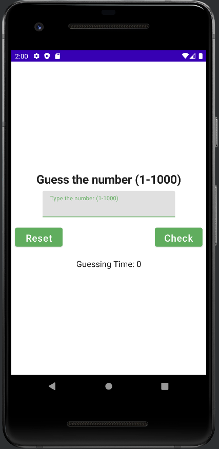
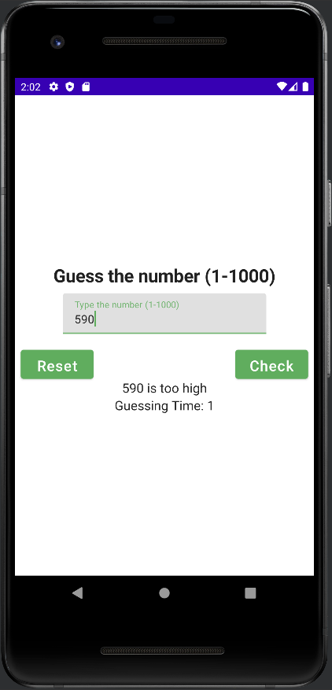
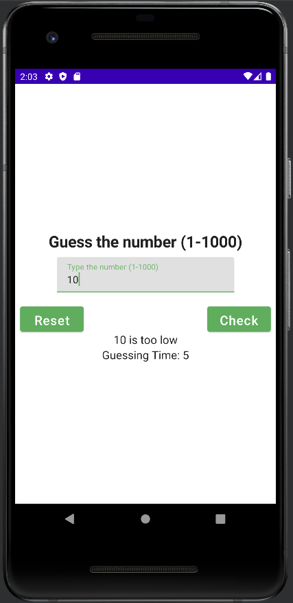
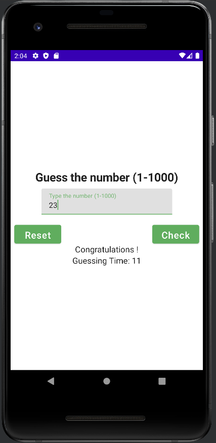

# cn333as3
Application Number Guessing Game จะมีการทำงานดังนี้
1. เริ่มต้นโปรแกรมจะทำการสุ่มค่าค่าหนึ่งที่อยู่ในช่วง 1-1000 ไว้
2. จากนั้นผู้เล่นจะทำการป้อนค่าเข้ามาแล้วโปรแกรมจะทำการตรวจสอบว่าค่านั้นตรงกับค่าที่ได้สุ่มไว้ในตอนแรกหรือไม่
3. ถ้าหากน้อยกว่า จะมีข้อความแสดงขึ้นมาว่า $number is too low 
4. หากค่าที่ป้อนเข้ามามีค่าสูงกว่าจะมีข้อความแสดงขึ้นมาว่า $number is too high 
5. ทั้งนี้ระหว่างการทำงานของโปรแกรมจะมีการนับจำนวนการ input ว่าผู้เล่นได้ทำการ input ไปทั้งหมดกี่ครั้งก่อนที่จะสามารถทายค่าที่ถูกต้องออกมาได้

## interface

   
   
   
   

## Demo Link
[CN333 - as3 NGG Jetpack Compose Demo | Raned Chuphueak](https://youtu.be/qmkrn1G6wNI)

## Contributor
รเณศ ชูเผือก 6210612864

